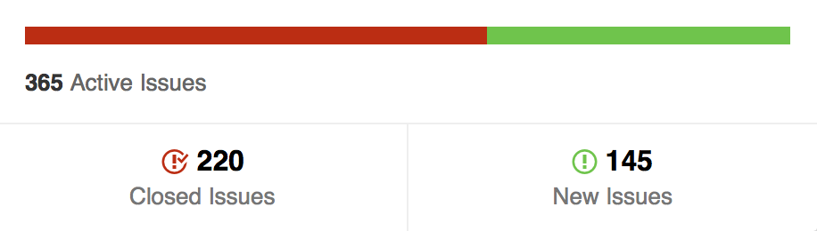

# [ESOF] Relatório 2 - Gestão de requisitos

## Levantamento de requisitos
Para uma compreensão detalhada do processo de levantamento de requisitos utilizados
no projeto torna-se vital compreender e distinguir as duas principais fases de
desenvolvimento do mesmo. Com efeito, o Atom começou a sua existência como
um projeto inspirado na visão do seu criados e único programador, tendo
sido eventualmente posto de parte pelo mesmo.

Apenas mais tarde seria o projeto retomado, desta vez pela empresa *GitHub*,
que adotou o modelo de *open-source* que atualmente o caracteriza. Esta adoção
operou uma mudança significativa nas metodologias de levantamento de requisitos e
sua negociação e validação, passando todo este processo a operar-se sob uma
ampla plataforma comunitária, que a par da equipa do *GitHub* se revela um dos
mais importantes *stakeholders* do produto final.

### Contexto Inicial
Dadas as circunstâncias sob as quais surgiu o projeto, explicadas em mais detalhe
no primeiro relatório, o levantamento de requisitos foi baseado na
experiência pessoal do primeiro programador do projeto, Chris Wanstrath.

Das necessidades identificadas destacam-se as seguintes, pela influência que
revelaram ter na descrição dos requisitos do projeto.[1](#ref1):

* O editor de texto deve funcionar por cima de uma interface baseada em
tecnologias web;
* Deve ser possível, virtude das tecnologias web utilizadas, que todas as
funcionalidades sejam alteradas facilmente;
* Deve ser fácil de utilizar.

Do acima mencionado decorre que, no contexto do que tradicionalmente se define
como levantamento de requisitos em Engenharia de Software, ocorreu,
no que ao Atom diz respeito, uma sobreposição dos papeis tipicamente associados
ao do cliente e do engenheiro de software. Esta sobreposição fica
particularmente clara na forma como a equipa fala sobre a origem do seu projeto
em [1](#ref1):
> Atom started as a side project of GitHub founder @defunkt (Chris Wanstrath)
 way back in mid 2008, almost exactly seven years ago. He called it Atomicity.
> **His dream was to use web technologies to build something as customizable as
 Emacs and give a new generation of developers total control over their editor**.

Um dos efeitos mais notáveis desta sobreposição é o facto de se encontrar, neste
contexto, referências às tecnologias particulares a serem utilizadas,
pormenores técnicos que regra geral não são refletidos no

Revela-se também de grande importância para a compreensão do processo de levantamento
de requisitos usado a contextualização do Atom enquanto projeto *open-source*,
cujas características não-comerciais e de estruturação das equipas de desenvolvimento
tornam, na nossa perspectiva, dificil a aplicação de modelos convencionais de
levantamento de requisitos, sendo exigidos novos métodos que permitam abarcar
a natureza descentralizada e colaborativa dos utilizadores e dos contribuidores
para o projeto.

## Das necessidades aos requisitos [2, pg 6](#ref2)
Os requisitos até agora listados são uma análise não sistematizada nem
formalizada das necessidades identificadas pelo cliente. Não foi possível,
analisando a documentação disponível ou pela fala com os desenvolvedores
do projeto, chegar aos requisitos de sistema identificados. É aliás altamente
improvavel que, dado o contexto de desenvolvimento inicial, os mesmos tenham
sido formalizados.

Como exercicio de engenharia de software segue pois uma hipotética lista
de requisitos formalizados que poderiam ter sido utilizados, agrupadas por tipo
[2, pg 13](#ref2):

###### Requisitos Funcionais
* O programa deve permitir a manipulação de *buffers* de texto.
* O programa deve providenciar, para o requisito acima, uma interface similar
a de outros programas comummente utilizados para esta tarefa.
* O programa deve permitir que a interface de manipulação previamente
mencionada seja alterada conforme as necessidades do utilizador, garantindo
flexibilidade na mesma.
* O programa deve permitir que os *buffers* manipulados ou criados
sejam gravados em disco, e deve permitir a leitura de buffers gravados
em disco para que possam ser manipulados.
* O programa deve permitir a instalação de funcionalidades adicionais
providenciando ao utilizador um sistema que permita gerir as *packages*,
contendo as alterações em causa, facilitando o processo de as descarregar,
ativar/desativar e apagar.
* O programa deve providenciar suporte a funcionalidades comummente utilizadas
na área da programação ou manipulação de código, como a indentação automática
ou o realce sintático de palavras ou segmentos de texto.
* O programa deve facilitar a edição de multiplos ficheiros, por meio de
tabulações e de funcionalidades que permitam gerir vários ficheiros em
simultaneo.

###### Requisitos não Funcionais [3](#ref3)
* Deve ser providenciada aos desenvolvedores de packages uma *framework*
de interpretação dos programas escritos em *javascript*.
* A estrutura da interface do programa deve ser especificada em *HTML* e o
seu aspeto em *CSS*, permitindo a sua interpretação pela *framework*
supramencionada.
* A plataforma deve providenciar capacidades que facilitem o desenvolvimento
do programa, como sejam um *debugger* e um *profiler* de desempenho.
* Deve permitir a recolha de dados acerca de problemas que tenham levado
à uma eventual anormal interrupção do programa.
* Deve facilitar o *deployment* de atualizações, fruto do modelo de iteração
utilizado para o desenvolvimento do programa.

### *Issues* do GitHub
O projeto usa a interface de issues do GitHub para recolher os diversos
problemas e solicitações de funcionalidades que vão sendo formuladas pelos
 utilizadores do programa.

### Priorização
Nem todos os problemas levantados pela comunidade merecem, por parte da equipa
que gere o projeto, a mesma atenção a nível de tempo e recursos. Para fazer a
triagem e escolher os assuntos sobre os quais a equipa principal do projeto
se vai focar, a mesma efetua reuniões semanais, todas as segundas-feiras,
nas quais decide como vai alocar os seus recursos ao longo da semana seguinte.

### Abordagem ao desenvolvimento
Qualquer membro da comunidade de desenvolvimento do Atom pode trabalhar em
qualquer um dos requisitos elicitados na secção de *Issues*.

A equipa principal, contudo, foca-se em resolver os assuntos levantados na
reunião supramencionada, cujos *Issues* correspondentes estão marcados com uma
*tag* especial que os assinala como prioritários.

### Análise dos Resultados
Esta abordagem parece permitir à equipa responder de forma eficaz às
solicitações de requisitos por parte da comunidade. No mês anterior,
por exemplo, a equipa conseguiu responder a mais de metade dos *issues*
abertos pela comunidade, conforme ilustrado na figura abaixo.

## Validação de requisitos
Cabe nesta área efetuar, para cada alteração ao software, uma validação quer do
cumprimento do problema ou funcionalidade que a alteração procura corrigir ou
acrescentar, quer da estabilidade estrutural do software, por forma a que não
seja introduzidos problemas adicionais na tentativa de corrigir problemas
antigos.

### Validação do cumprimento

Tomando proveito da comunidade existente à volta do projeto, a equipa de
desenvolvimento do Atom consegue lançar novas funcionalidades, bem como
*bugfixes*, recebendo *feedback* muito mais celeremente do que seria possível
em projectos privados. Assim acaba por ser os próprios *stakeholders* a validar
que os problemas estão efectivamente corrigidos, não existindo um mecanismo
formal que efetue esta verificação por parte da equipa de desenvolvimento.

### Validação da retro-funcionalidade

É vital que as correções que vão sendo introduzidas provoquem o mínimo de problemas
 possível nas componentes já desenvolvidas. Para permitir detetar estes problemas mais
facilmente o projeto usa funcionalidades do GitHub que permitem assegurar que cada *pull
request* passa uma *suite* de testes unitários.

Adicionalmente, todos os problemas que sejam introduzidos, malogrado o mecanismo de prevenção supracitado,
 são priorizados para correção nas reuniões semanais do projeto.

## Referências
<a name="ref1" href="http://blog.atom.io/2015/06/25/atom-1-0.html">1) Atom 1.0</a> 
<a name="ref2" href="https://moodle.up.pt/pluginfile.php/68505/mod_resource/content/2/ESOF-Requirements%20Engineering.pdf">2) Slides da Unidade Curricular </a>
<a name="ref3" href="http://electron.atom.io/">3) Electron</a>
