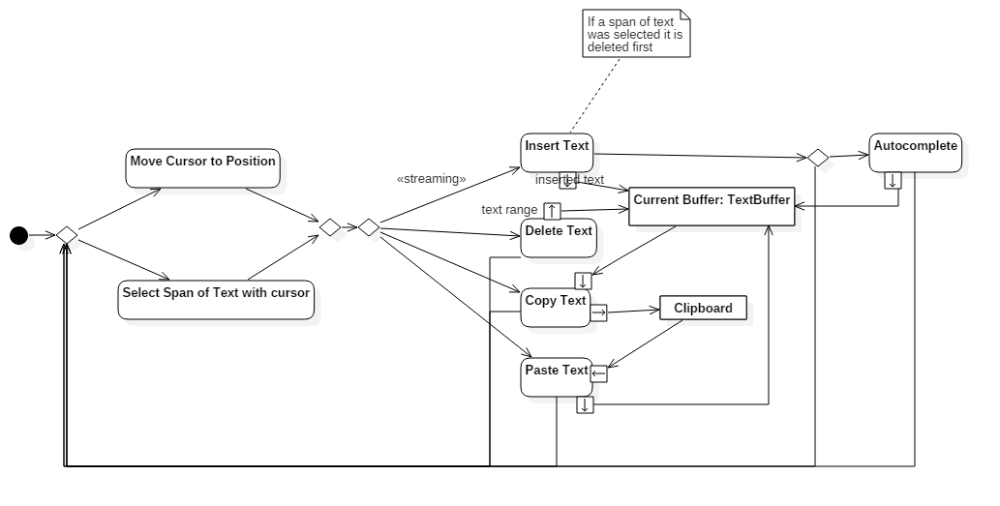
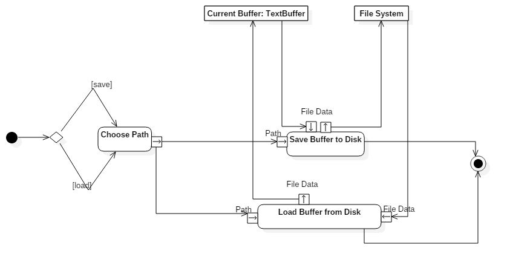

# [ESOF] Relatório 3 - Arquitetura de Software

## O modelo 4+1

  O modelo 4+1 de Arquitetura de Software permite agregar vários pontos de vista sobre o mesmo *software* para dar uma perspectiva o mais completa possível sobre o mesmo. Este modelo baseia-se então nos pontos de vista apresentados a seguir.

### Logical View

Esta vista apresenta as abstrações chave do sistema, tradicionalmente sob a forma de classes, objetos ou *packages*.

Para melhor apresentar as abstrações chave do Atom, e visto que o mesmo não aparenta ter uma organização baseada em *packages*, é da opinião do grupo que um diagrama de classes é a melhor opção.

<Insert Class Diagram here>

### Implementation View

  Esta vista permite observar a decomposição do sistema do ponto de vista programático, geralmente através de um diagrama de componentes.  

  <Insert Component Diagram here>

### Process View

  Esta vista mostra os vários processos do sistema bem como as suas interações em *run-time*. Um editor de texto permite a execução de um conjunto de actividades bastante diverso, sendo necessário implementar um conjunto muito diverso de funcionalidades que operam direta ou indiretamente sobre o buffer de texto a editar. Optou-se neste relatório por ilustrar apenas dois conjuntos de atividades essenciais: a manipulação básica de buffers de texto e de clipboards e as operações que permitem guardar e abrir ficheiros de texto de e para buffers.

  Deve-se a seleção de atividades supramencionada ao facto de muitas das funcionalidades que complementam as a seguir ilustradas são implementadas em *packages* separados e portanto não se enquadrarem, num sentido estrito, no ambito do presente relatório, para além do facto de permitir uma compreensão mais sucinta das atividades regularmente operadas sobre o Atom.

  
  

### Deployment View

  Esta vista visa representar o sistema através da interação das componentes de *software* com o hardware do sistema. (Alguém que reveja isto sff.)

  <Insert Deployment Diagram here>

### Use Case View

  Esta vista pode ser interpretada como a chave para a compreensão de todo o modelo 4+1. É nesta vista que se  relacionam as restantes vistas, tornando claras as interações entre as várias componentes do sistema, bem como o comportamento do mesmo sob determinadas situações.

  Devido à inclusão do diagrama de casos de uso no último relatório elaborado, este não será incluído no presente documento.

  ## Análise crítica

  No que ao
