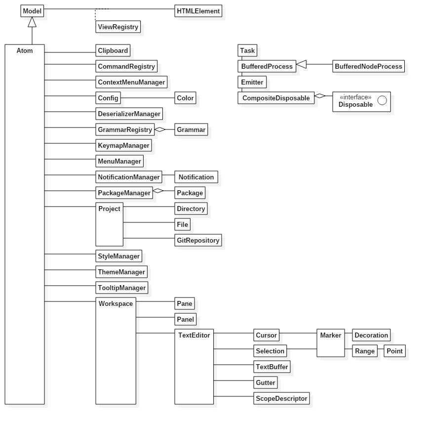
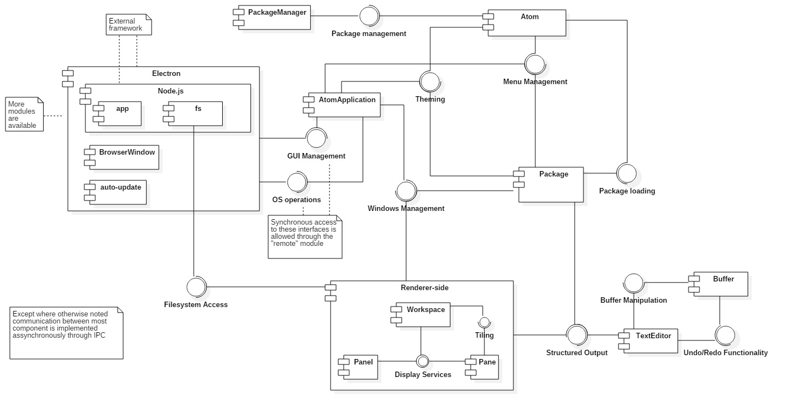
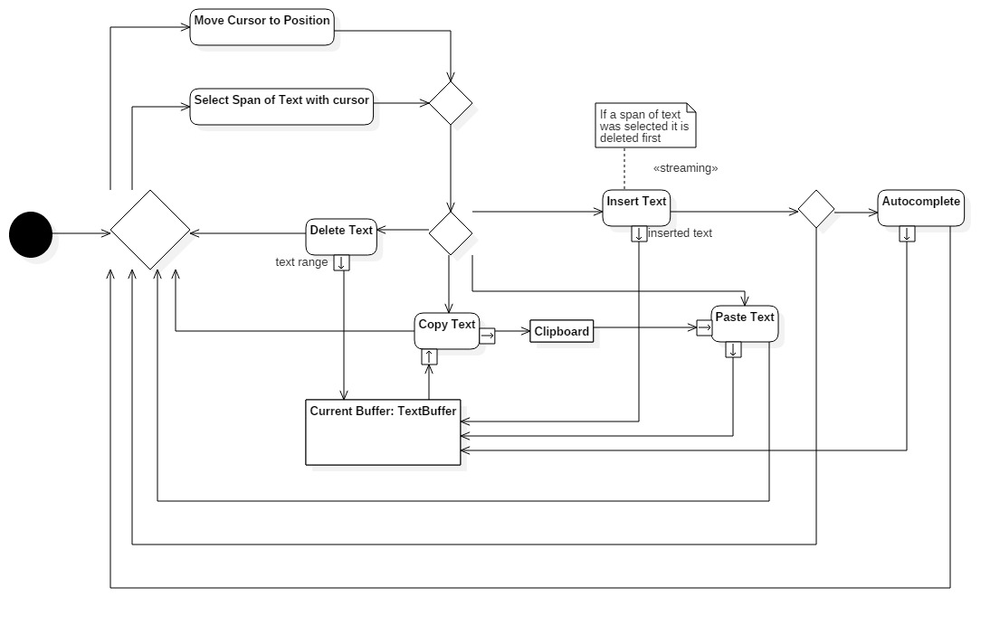
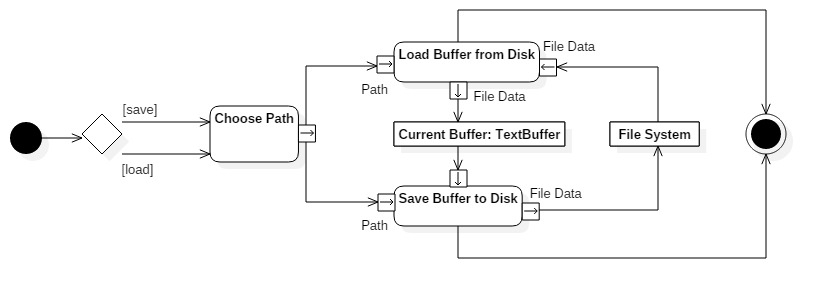
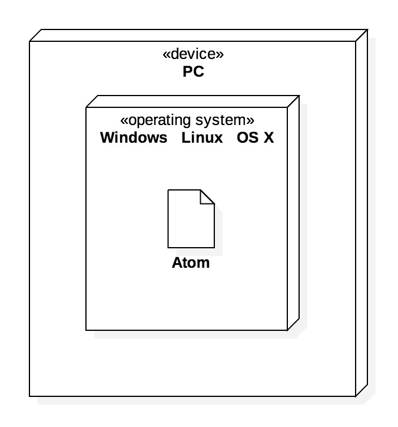

# [ESOF] Relatório 3 - Arquitetura de Software

## O modelo 4+1

  O modelo 4+1 de Arquitetura de Software permite agregar vários pontos de vista sobre o mesmo *software* para dar uma perspectiva o mais completa possível sobre o mesmo. Este modelo baseia-se então nos pontos de vista apresentados a seguir.

### Logical View

  Esta vista apresenta as abstrações chave do sistema, tradicionalmente sob a forma de classes, objetos ou *packages*.

  Para melhor apresentar as abstrações chave do Atom, e visto que o mesmo não aparenta ter uma organização baseada em *packages*, é da opinião do grupo que um diagrama de classes é a melhor opção. Como mostra o diagrama, existe uma "classe principal", Atom, que relaciona e gere quase todos os componentes do programa. Importa também salientar que o que aqui está representado é apenas o Atom puro, sem todas as funcionalidades avançadas que estão disponíveis no produto final. Essas funcionalidades são implementadas através de *packages* externos, cada um alojado no seu próprio repositório, e por esse motivo não são contempladas neste relatório. Estamos, portanto, a estudar um editor de texto extremamente básico.

### Implementation View

  Esta vista permite observar a decomposição do sistema do ponto de vista programático. Ela permite perceber quais os principais componentes do sistema em estudo e como estes interagem entre eles, geralmente através de um diagrama de componentes. Torna-se pertinente, no contexto do Atom, mencionar o programa que o mesmo usa como base, o [Electron](http://electron.atom.io/). Este programa tem como funções a interação com o sistema operativo, maioritariamente para interação com o sistema de ficheiros do mesmo, bem como a gestão das janelas referentes ao *browser*.

  

### Process View

  Esta vista mostra os vários processos do sistema bem como as suas interações em *run-time*. Um editor de texto permite a execução de um conjunto de actividades bastante diverso, sendo necessário implementar um conjunto muito diverso de funcionalidades que operam direta ou indiretamente sobre o buffer de texto a editar. Optou-se neste relatório por ilustrar apenas dois conjuntos de atividades essenciais: a manipulação básica de buffers de texto e de clipboards e as operações que permitem guardar e abrir ficheiros de texto de e para buffers.

  Deve-se a seleção de atividades supramencionada ao facto de muitas das funcionalidades que complementam as a seguir ilustradas serem implementadas em *packages* separados e portanto não se enquadrarem, num sentido estrito, no ambito do presente relatório.

  
  

### Deployment View

  Esta vista visa representar o sistema através da interação das componentes de *software* com o hardware do sistema. No caso do Atom, estamos a falar de uma aplicação desenvolvida para *desktop*. Como se trata de um editor de texto extremamente simples (uma vez que todas as funcionalidades mais avançadas do Atom são implementadas por packages externos, alojados nos seus próprios repositórios), o único *hardware* onde é feito o *deployment* é um computador, sem haver a necessidade de qualquer tipo de servidor. O Atom tem a particularidade de ser uma aplicação multi-plataforma, podendo ser executado tanto em ambiente Windows como em Linux ou mesmo OS X. Assim, o diagrama de *deployment* torna-se extremamente simples.

  

### Use Case View

  Esta vista pode ser interpretada como a chave para a compreensão de todo o modelo 4+1. É nesta vista que se  relacionam as restantes vistas, tornando claras as interações entre as várias componentes do sistema, bem como o comportamento do mesmo sob determinadas situações.

  Devido à inclusão do diagrama de casos de uso no [último relatório](https://github.com/jrfcabral/atom/blob/Relatorio/ESOF-docs/relatorio2.md#diagrama-de-casos-de-uso) elaborado, este não será incluído aqui.

### Análise Crítica

  Os diagramas apresentados neste relatório foram realizados pelos autores do mesmo, sendo baseados no estudo e interpretação dos ficheiros presentes no repositório do projeto.

  Quanto à vista lógica do projeto, é da opinião do grupo que a organização efetuada pelos autores do mesmo podia ser melhorada através duma separação em pacotes. Isto facilitaria a compreensão do funcionamento do programa, algo que pode ser importante dada a natureza *open-source* do projeto em estudo.

  Como é mencionado acima, a aparente falta de organização do projeto tende a dificultar a análise do mesmo. Assim, a sua compreensão por parte dos autores do presente relatório demorou algum tempo a atingir níveis aceitáveis e suficientes para a elaboração do mesmo. No entanto, é de realçar que o Atom tem uma [página de documentação](https://atom.io/docs/api/v1.1.0/Atom) das suas classes, onde estas estão bastante bem explicadas individualmente.

### Trabalho realizado por:

* Ana Casimiro - anacasimiro1995@gmail.com
	* Contribuição: 10 horas
* João Bernardino - joao.mnb@gmail.com
	* Contribuição: 10 horas 	
* João Cabral - up201304395@fe.up.pt
	* Contribuição: 10 horas
* João Mota - up201303462@fe.up.pt
	* Contribuição: 10 horas
