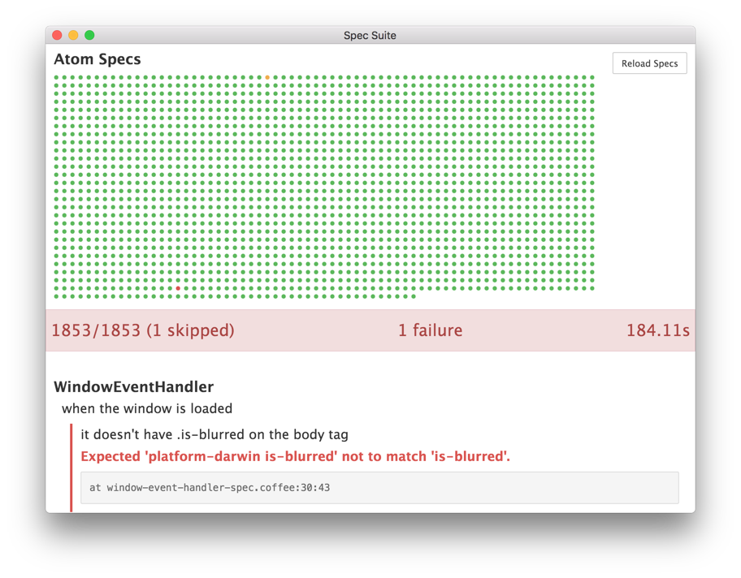
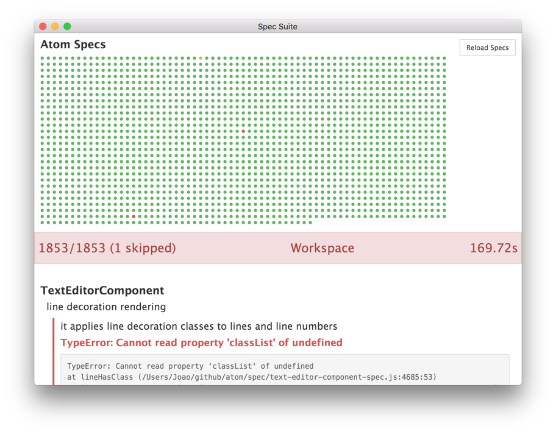

# [ESOF] Relatório 4 - Verificação e Validação

Este é o quarto relatório dedicado à análise dos processos de engenharia de software empregues pelo projeto *open-source* Atom. Desta feita serão analisados os processos de verificação e validação
empregues pela equipa no desenvolvimento da aplicação. Em primeiro lugar serão discutidas as caracteristicas lógicas e organizacionais do código e da tecnologia de especificação de testes utilizada. Procura-se entender de que forma é que a base de código de aplicação se ajusta e enquadra no contexto da execução de testes unitários e de integração e tambem quais as valências da plataforma de testes utilizada que permite ultrapassar os principais desafios que se lhe colocam, nomeadamente o da isolação de componentes e a controlabilidade dos testes sobre o seu comportamento.

## Bug Reports, Testes e Revisão de Código

### Grau de Testabilidade
No toca à testabilidade, o Atom aparenta estar bem estruturado. A arquitetura do programa, baseada em pacotes e classes, introduz uma modularidade que torna simples a eficaz separação dos testes a correr, enquanto que a sua base, o electron, permite que haja coesão e comunicação entre os diferentes componentes, podendo assim testar-se também aspetos de comunicação em diferentes módulos com facilidade.

Nas subsecções seguintes serão analisados em maior detalhe os vários aspetos que permitem avaliar as caracteristicas de testabilidade.

#### Controlabilidade dos componentes em estudo
O Atom apresenta uma organização de código e um paradigma de programação orientado ao objecto, recorrendo às capacidades que o *javascript* confere nesta área. A linguagem de programação utilizada
fornece as ferramentas adequadas para permitir manipular de forma completa e controlada tanto o comportamento dos objetos instanciados como o valor dos dados neles guardados. Os testes unitários são  tendencialmente orientados ao estudo do comportamento de cada classe e objeto em particular, sendo o seu contexto abstraído com recurso a várias técnicas, que se discutirão em maior profundidade na secção sobre Isolabilidade. É portanto possível compreender que as caracteristicas de controlabilidade dos componentes do Atom se ajustam particularmente bem à realização de testes unitários.

Ao nível intermédio são ainda de salientar as capacidades de análise de comportamento fornecidas pelo *Jasmine*. A *framework* permite que sejam definidos um conjunto de *spies* a operar sobre métodos de objetos, que permitem extrair informação detalhada sobre a forma como os mesmos estão a ser chamados dentro do código. Fica assim possibilitado um controlo de granularidade bastante fina não só das entradas e saídas de cada objeto ao nível do teste unitário, mas também do seu comportamento interno. Por exemplo é possível definir um *spy* que regista as chamadas efetuadas a uma função, e mais tarde é possível fazer o teste falhar se essa função não tiver sido chamada no decorrer do teste.

Outro tipo de testes que são frequentemente utilizados são os de integração. Este tipo de testes incide principalmente sobre as interfaces utilizadas e sobre a articulação inter-componente. Neste contexto cabe realçar as facilidades de comunicação fornecidas pela plataforma *Electron* sobre a qual o *Atom* está construído. Esta plataforma define de forma clara uma separação em dois componentes de todo o *software* que sobre ela se construa, como já foi discutido em profundidade no relatório 3. O *Electron* define também as interfaces de comunicação entre componentes que podem ser utilizadas. Sendo todas estas interfaces de comunicação genéricas, é sobre elas que deve, em princípio, ser construído um protocolo de comunicação especifico da aplicação a desenvolver. Torna-se assim possível controlar, pela invocação dos métodos de comunicação fornecidos, o comportamento do sistema, manipulando a forma de integração inter-componente.

#### Observabilidade dos resultados dos testes
Os testes do *Atom* são corridos sobre uma plataforma tecnológica baseada numa *framework* de definição de especificações para *JavaScript* denominada *Jasmine*. A *framework* usada dispõe de uma *GUI* integrada no próprio Atom que permite analisar detalhadamente o resultado de cada teste. Em caso de falha é possível extrair informação relativa à asserção que falhou com facilidade.

A natureza distribuída dos projetos *open-source*, parece, na opinião dos autores do presente relatório, exigir que seja garantida não só a observabilidade dos resultados dos testes corridos sobre as alterações efetuadas por cada programador, como também que seja possível analisar os resultados dos teste corridos sobre código desenvolvido por terceiros e que não esteja ainda integrado na base de código do projeto. Para este fim o *Atom* recorre à plataforma de testes *Travis CI*, que possibilita a integração da interface de *pull requests* com a *suite* de testes, sendo os resultados visiveis na página correspondente ao *pull request*.

#### Isolabilidade
A isolabilidade das diferentes componentes do Atom varia consoante o caso. Existem componentes que funcionam por cima de outras, como por exemplo no caso da classe *TextEditor*, cujo método de inicialização exige uma instância da classe *Workspace*. A sua testabilidade individual ao nível dos testes unitários fica assim comprometida, pois não mais se pode considerar que está a ser seguido um modelo *black box* onde alterações exteriores podem influenciar de forma não controlável o resultado dos teste, devido a variações, à partida não previsiveis, dos dados de *input* no sistema em teste.

Para permitir evitar este problema o Atom recorre à facilidades de isolação fornecidas pela framework de testes *Jasmine* utilizada. São disponibilizados um conjunto de funções que operam sobre métodos de um objeto que permitem controlar o seu comportamento. Em concreto é possível efetuar a substituição do valor de retorno do método por um pré-determinado no contexto do teste, provocar o lançamento de erros quando um método for chamado, mesmo que em circunstâncias normais esse erro não fosse causado, ou mesmo substituir a invocação do método por outro.

Estas facilidades permitem a definição de *mocks* que garantem que cada objeto pode, com a devida diligência, ser completamente isolado do seu contexto.

#### Separação das responsabilidades de cada componentes
No contexto da validação e verificação de requisitos de software uma estrita separação de componentes é altamente vantajosa do ponto de vista da facilidade da definição de teste que sejam exaustivos quanto ao comportamento de cada classe, testando-o não só corretamente como também integralmente. Uma classe que assuma demasiadas responsabilidades ou responsabilidades de foros muito diferentes é não só mais suscetível à introdução de falhas quando alterada como também mais difícil de testar e validar.

A arquitetura do Atom é, como já foi referido, baseada em classes e, virtude da plataforma *Electron* sobre a qual é construída, intrinsecamente separada em componentes de lógica e apresentação de dados. Para além disso o *Atom* adotou uma estrutura modular ao nível de diversos *packages* que são responsáveis pela implementação de componentes diversos no contexto de um editor de texto, sendo que é da integração do *Atom* propriamente dito com as restantes *packages* que o compõe que resulta um editor de texto plenamente funcional. Assim o *Atom* apresenta um estrutura externa de responsabilidades altamente segmentadas e claramente definidas, reservando para si apenas o papel de gestor da interface com o utilizador e de coordenador das diversas *packages* centrais ao funcionamento correto do programa.

Analisando a estrutura interna do *Atom* observa-se que o mesmo separa de forma explicita
a sua funcionalidade por diversas classes que posteriormente se articulam entre si. A separação de responsabilidades é assegurada de forma bastante estrita. Por exemplo o [cursor](https://github.com/atom/atom/blob/master/src/cursor.coffee) de texto é isolado do restante editor através do uso da orientação a objetos: a sua manipulação é completamente independente da execução de outros comandos de manipulação de texto como seja a substituição de palavras ou o recurso ao *clipboard*, cuja responsabilidade recai sobre a classe [*text-editor*](https://github.com/atom/atom/blob/master/src/text-editor.coffee). Outro exemplo revelador desta cuidada separação é o total isolamento da gestão de [comandos](https://github.com/atom/atom/blob/master/src/command-registry.coffee) e [*keybindings*](https://github.com/atom/atom/blob/master/src/command-installer.coffee)  entre si e entre as classes que são responsáveis pela execução da alteração solicitada.

#### Compreensibilidade
O Atom está [bem documentado](https://atom.io/docs/api/v1.2.3/AtomEnvironment), em parte devido à sua natureza *open-source*, que obriga a que a documentação seja explícita e concisa para que possa ser consultada e aprendida celeremente e compreendida pelo maior número de pessoas possível.

A arquitetura do *Atom* é complexa e algo extensa, resultando a sua cuidada separação de responsabilidades num leque alargado de classes cujos nomes e comportamento podem não resultar evidentes para um leigo no que a terminologia de editores de texto diga respeito. Posto isto, os autores do relatório consideram que existe, integrado no código, uma organização documental suficiente para suprir o problema descrito, e para permitir a quem o estuda uma compreensão adequada dos objetivos de cada componente, quer ao nível da classe quer ao nível dos métodos individuais. Um bom exemplo desta documentação é a classe [cursor](https://github.com/atom/atom/blob/master/src/cursor.coffee) onde se pode observar que cada função está documentada na integra ao nível do comportamento dos métodos, do seu valor de retorno e dos parametros que lhes devem ser passados e seu valor por defeito.

#### Heterogeneidade
No repositório do Atom está disponível uma bateria de testes de tamanho considerável. Estes testes são na sua maioria testes unitários, existindo um único teste de integração que incide sobre o comportamente de inicialização do *Atom*. O Atom vem equipado com funcionalidades que lhe permitem correr esses testes dentro de si mesmo.

O *Atom* é um software bastante homogéneo de um ponto de vista técnológico, o que se reflete de forma clara na sua suite de testes. A definição de especificações em *Jasmine* é feita integralmente em *CoffeeScript*, o que é suficiente dado que toda a base de código está escrita nesta mesma linguagem, que compila diretamente para *JavaScript*.

### Estatísticas dos Testes
Como já foi mencionado, o Atom disponibiliza uma bateria de testes no seu repositório. Os mesmo estão separados por vários ficheiros, conforme a classe sobre a qual incidem. Presentemente parecem existir 1853 testes unitários distintos, bem como alguns testes de integração. O Atom fornece ainda scripts que permitem correr estes testes de várias formas, incluindo suporte para Travis CI e, mais recentemente, AppVeyor CI.

### Análise Crítica

Quanto ao grau de testabilidade do Atom, é da opinião do grupo que, dada a sua organização e arquitetura, é adequado. O grau de controlabilidade fornecido pelas linguagens do paradigma de orientação a objetos permite manipular os componentes a testar sem grandes embaraços.

A observabilidade é também algo beneficiada pela orientação a objetos dada a facilidade com que se obtém informação sobre os dados contidos na instância duma classe. Este aspeto, aliado à ferramenta de testes *Jasmine*, resulta num grau de observabilidade bastante bom.

Já a isolabilidade das componentes em estudo é, de certa forma, prejudicada pelo modularidade do Atom, já que as dependências dos mesmos obrigam à sua associação para o correto funcionamento do mesmo. Esta dificuldade é ultrapassada nos testes, como foi referido acima, através de *mocks*. Assim, é de concluir que também no que toca a este aspeto, a testabilidade do programa é decente.

A separação das responsabilidades entre componentes está, na opinião dos autores do presente relatório, e como já foi referido, bastante explicita. Isto facilita o teste das diferentes funcionalidades do programa, conseguindo-se assim testes unitários mais eficazes. Neste aspeto vem também auxiliar a compreensibilidade do Atom, que é, como referido acima, bastante boa.

Por fim, quanto à heterogeneidade, dada a utilização de poucas tecnologias distintas , o *Atom* não revela problemas assinalaveis que impliquem a utilização de soluções teconológicas muito diversas. O fornecimento de uma bateria de testes, bem como a funcionalidade de correr os mesmos dentro de si próprio vêm facilitar o processo de teste, visto não ser necessário recorrer a *software* externo, não sendo assim necessárias quaisquer adaptações para o funcionamento dos mesmos.

Após todo o trabalho de investigação que desenvolvemos sobre o Atom, ao longo deste relatório, os autores consideram que o balanço final não é exactamente aquele que seria expectável. Ao serem corridos os testes unitários disponibilizados, são obtidos resultados algo confusos. Nunca todos os testes foram concluídos com sucesso, no entanto, nem sempre são os mesmos a falhar. É de salientar que este processo foi repetido mais que uma vez nos sistemas operativos OS X e Linux. Em ambiente Windows, ocorrem erros que não permitem sequer a realização dos testes.

Quanto à análise da cobertura dos testes unitários, foram obtidos resultados ainda piores. Tentando recorrer a várias ferramentas de *code coverage*, nomeadamente [**istanbul**](https://github.com/gotwarlost/istanbul) e [**JSCoverage**](http://siliconforks.com/jscoverage/), surgiram sempre erros que impediam o processo de análise. Estas *frameworks* acusavam alguns erros de sintaxe, entre outros. Assim, infelizmente, neste relatório não é possível contemplar a qualidade dos testes unitários incluídos no repositório, em termos de cobertura do código.
