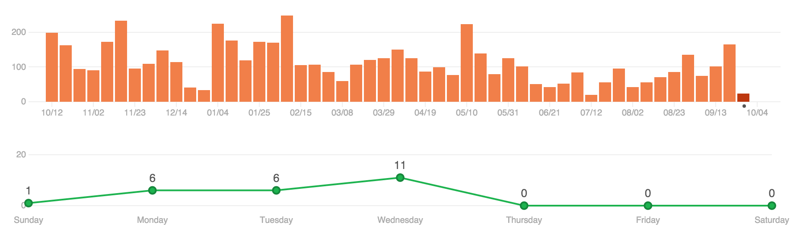

# [ESOF] Relatório 1

### Descrição do Projeto
O [Atom](https://atom.io/) é um programa de edição de texto [open-source](https://github.com/atom/atom).
O objetivo do programa é proporcionar aos utilizadores um editor de texto que tenha à partida
todas as capacidades que são esperadas de um editor moderno,
permitindo-lhes sinultaneamente um controlo o mais completo possível sobre as
funcionalidades implementadas, por forma a que seja fácil
alterá-las. Daí o seu moto: "A hackable text editor
for the 21st Century".

Para facilitar a gestão e a partilha das modificações, o Atom vem
equipado com um gestor de pacotes. As funcionalidades base, como os realces
de sintaxe e as ferramentas de sugestão automática de texto, são implementadas
como pacotes independentes. O próprio aspeto gráfico da aplicação é também um
pacote, o que faz com que tudo isto seja completamente personalizável.

O Atom possui também uma comunidade ativa, a qual desenvolve pacotes dotados das mais variadas funcionalidades, tomando assim o máximo proveito do conceito de open-source.

Este editor é desenvolvido utilizando HTML, JavaScript (CoffeeScript), CSS e Node.js. Apesar de ser uma aplicação para desktop é construída utilizando tecnologias web. Isto torna possível que seja executada nas principais plataformas (OS X, Windows e Linux).

### História do Projeto
Este projeto, inicialmente batizado "Atomicity", começou como um projeto pessoal de
[Chris Wanstrath](https://github.com/defunkt) em meados de 2008. No entanto, de forma a
poder focar-se no seu projeto principal, [GitHub.com](http://github.com), Atomicity foi posto de parte. Foi apenas em agosto de 2011 que o projeto voltou a ficar ativo, com Wanstrath e [Corey Johnson](https://github.com/probablycorey) a trabalharem no mesmo nos seus tempos livres. Em novembro de 2011, Atomicity foi renomeado "Atom", como é hoje conhecido, e em dezembro do mesmo ano, [Nathan Sobo](https://github.com/nathansobo) juntou-se à GitHub para traballhar no editor de texto a tempo inteiro. A 26 de fevereiro de 2014 é lançada a versão Beta, aberta ao público, sendo também publicado o código fonte do projeto, incluindo várias bibliotecas e pacotes utilizados no mesmo. Atom torna-se completamente aberto ao público a 6 de maio 2014 e é oficialmente lançado na sua versão 1.0 a 25 de junho de 2015.

### Estado da Arte
Hoje em dia, grande parte das atualizações feitas ao Atom consistem de bugfixes, com algumas otimizações e melhorias de algumas funcionalidades.

## Processo
Como foi referido acima, o Atom começou como um projeto pessoal e secundário. Assim, não parece existir qualquer tipo de documentação disponível ao público acerca das versões primordiais. Os primeiros commits abertos ao público disponíveis no repositório do programa [datam de agosto de 2011](https://github.com/atom/atom/commits?author=defunkt&page=14), pelo que apenas poderemos analisar o projeto a partir dessa data.

Dadas as frequentes atualizações do programa, é da opinião deste grupo que o processo
empregue neste projeto é o "Incremental development and delivery".
Características deste modelo incluem a frequência de atualizações do produto, bem como o facto de a maior parte dos incrementos feitos ao projeto serem imediatamente utilizáveis. Isto deve-se ao facto de todo o desenvolvimento ser dividido em pequenas partes. Cada uma destas partes passa pelas fases de design, desenvolvimento, testes e implementação. A aplicação vai então sendo desenvolvida passo a passo, módulo a módulo, estando sempre funcional, à medida que vão sendo acrescentadas funcionalidades.

Como podemos ver pelo gráfico, o projeto encontra-se ainda
ativo, com uma média de 111 commits por semana, desde 12 de outubro de 2014 até
ao dia de hoje, com um total de mais de 25 000 commits desde o primórdio.
É de salientar que após o lançamento final do Atom, a quantidade de commits tem
vindo a diminuir, no entanto, sem perder a sua atividade.

## Análise crítica
No âmbito dum projeto open-source, Incremental development and delivery é bom modelo a aplicar, pois permite usufruir da acessibilidade do público ao produto.

Quanto mais seguidores o projeto tiver, maior será a quantidade de feedback recebida, bem como a quantidade de pedidos de funcionalidades. Além disso, os pequenos incrementos facilitam a familiarização do público com os aspetos técnicos do projeto, permitindo que este contribua duma forma mais célere.

Ao mesmo tempo, este processo também revela alguns inconvenientes, pois ao permitir que as contribuições da comunidade sejam determinadas pela mesma torna-se impossível concentrar os esforços de todos os contribuidores no sentido de alcançar alguma milestone específica. Desta forma, no contexto do projeto em análise torna-se particularmente importante que a empresa que está por detrás do mesmo dirija os esforços dos seus trabalhadores no sentido de colmatar as falhas e desenvolver as funcionalidades essenciais que não estejam a ser cobertas pelas restantes contribuições. O sucesso do projeto fica assim algo condicionado ao interesse que a empresa revelar pelo mesmo.
